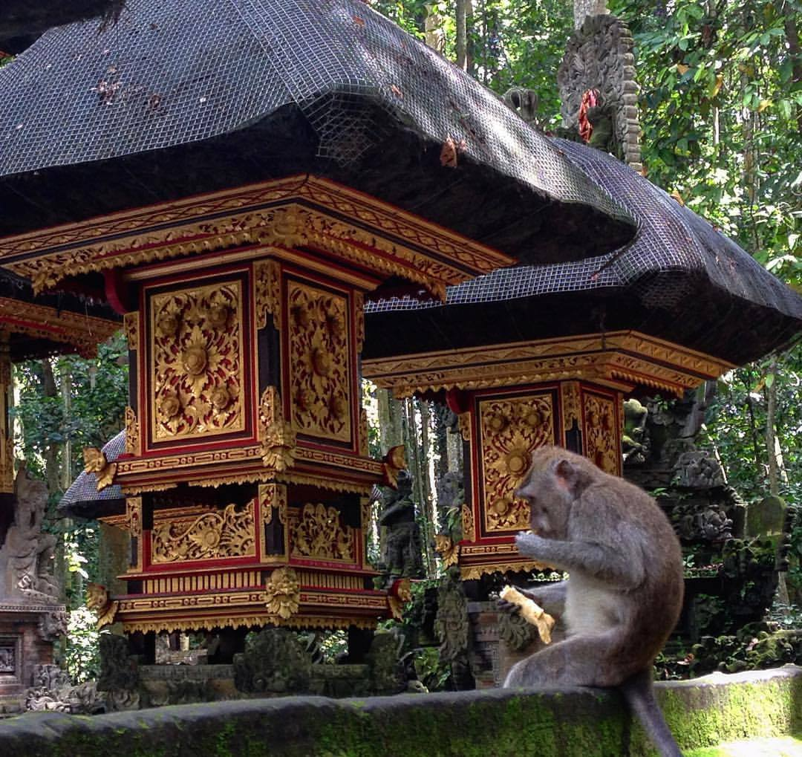

I am interested in primate-associated microbial communities and especially their role in modulating primate metabolism, immunity, and behavior. For my Master's Thesis, I am investigating the ways in which the diversity and composition of hair-associated microbial communities differ across primate body regions, genders, species, and the institutions they are housed at. I am hoping to do my dissertation work on microbial transmission across species (bats, baboons, fruits, and humans) living at Kasanka National Park in Zambia.

My other interests include paleobiology and human and non-human primate evolution...I love everything about fossils!

 
 